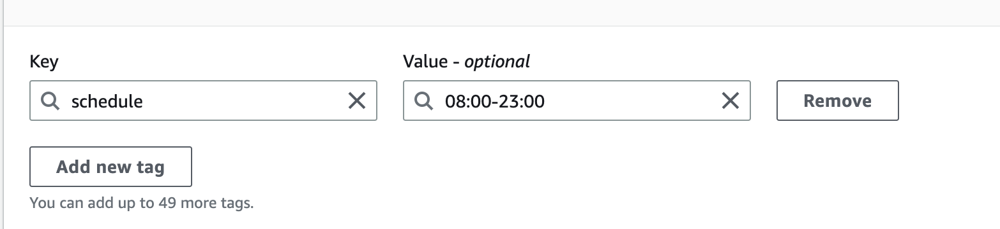

### Cloudformation template for stopping and starting lower environment EC2 instances after business hours and before the business day begins.

## Why this stack ? 

* As your estate grows, you may need some automation to manage your operations and possibly reduce the time it takes to implement when business demands.

* You are only charged for the hours that the services are operational. This solution can help you reduce operational costs by stopping resources that are not in use and starting resources when capacity is needed. You can use the CloudFormation (CFN) template as explained below.

### Features
To configure and implement this solution, we use the following high-level features:

    * The key "schedule" and a value in the format <code>06:00-21:00</code> should be included in the EC2 instance tag
    * If you schedule to start your instance at 9AM, the time should be 09:00, not 9 or 9:00.
    * Keep in mind that lambda uses UTC timezone. Convert your hours to UTC based on your work location.
     

## Configuration involved

    * Cloudformation
    * Python
    * Lambda
    * IAM
    * Eventbridge

## Steps
    The steps you need to follow to deploy the stack.

    1.  Select Create stack from the AWS CloudFormation console.
    2.  Select New Resources (standard).
    3.  Select Template is ready and then select Upload a template file.
    4.  Select Next after uploading the provided.yaml file.
    5.  Type <b>Name</b> into the Stack name field.
    6.  Select Next and, if necessary, provide tags.
    7.  Select Next and go over the stack details.
    8.  Because this template creates an IAM role and policy, check the acknowledgement box.
    9.  Select Create stack.
    10. To track the resource creation status, open the stack and navigate to the Resources tab.

## To delete all resources created by this template, navigate to the AWS CloudFormation console, select the stack, and then delete stack.
